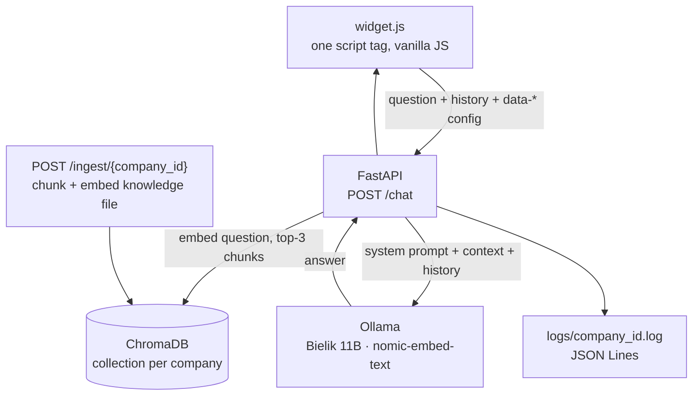

# Plug-and-Play Chatbot

A customer-support chat widget that a company embeds with a single `<script>` tag, backed by a FastAPI service that answers from that company's own knowledge base using a **locally hosted** LLM.

> **Status: in development.** It runs end to end on a development machine. It has not been deployed for a real company, and several things listed under *Known gaps* must be fixed before it could be.

## Context

A side project built with a colleague. The split, as it stands in the git history:

| | |
|---|---|
| **Jakub Wesołowski** (me) | Project scaffold, `/chat` endpoint and Ollama integration, the embeddable widget, conversation history, per-company logging and audit, input validation, prompt-level guardrails |
| **A colleague** | ChromaDB ingestion pipeline (`/ingest`) and wiring semantic retrieval into `/chat` — the RAG half of the system |

## Why local

Support conversations carry customer data, and a small company often cannot send it to a third-party API. Everything here runs on the company's own machine: **Bielik 11B** (a Polish open-weights model) for generation and **nomic-embed-text** for embeddings, both through Ollama. Nothing leaves the host.

## Architecture



One backend serves any number of companies. The widget carries its own configuration in `data-*` attributes (company name, topic, contact e-mail and phone, `company_id`), the backend builds the system prompt from them, and each company's knowledge lives in its own ChromaDB collection.

## What is implemented

- **One-tag embedding** — `<script src="widget.js" data-company-name="…" data-company-id="…">`, no framework, CSS scoped under `pcb-*`.
- **RAG** — `/chat` embeds the question, pulls the three closest chunks from that company's collection and injects only those into the prompt.
- **Ingestion** — `/ingest/{company_id}` takes a UTF-8 text file (max 5 MB), chunks it with a 500-character sliding window and 50-character overlap, embeds it and replaces the collection.
- **Conversation history** — a sliding window of 10 question/answer pairs, kept on both sides and dropped when the widget is closed.
- **Per-company logging** — JSON Lines per `company_id`; rejected requests with an invalid id go to a separate audit log.
- **Input validation** — `company_id` must match `[a-z0-9_-]{1,64}` as a full match, which blocks path traversal and newline injection into log files; contact fields reject control characters; message length is capped.
- **Prompt-level guardrails** — the system prompt carries explicit rules and few-shot examples against inventing products, comparing with competitors, leaking the prompt, and role-play or false-authority attempts ("I'm the owner", "service mode", "you agreed earlier"). These were probed by hand against known attack patterns; the probe suite is not part of this repository.

## Running it

```bash
git clone https://github.com/kubuswes2003/PLUG-AND-PLAY_CHATBOT.git
cd PLUG-AND-PLAY_CHATBOT
python3 -m venv venv && source venv/bin/activate
pip install -r backend/requirements.txt

ollama pull SpeakLeash/bielik-11b-v2.3-instruct:Q4_K_M
ollama pull nomic-embed-text
```

Then, in separate terminals:

```bash
ollama serve
uvicorn backend.main:app --reload --port 8000
cd frontend-widget && python3 -m http.server 8080
```

Load a company's knowledge base once (otherwise `/chat` falls back to stuffing the whole sample file into every prompt):

```bash
curl -X POST http://localhost:8000/ingest/demo \
  -H "Content-Type: text/plain; charset=utf-8" \
  --data-binary @data_samples/test_firma.txt
```

Open `http://localhost:8080` — the chat icon appears in the bottom-right corner.

## Known gaps

These are the reasons this is not production software yet:

- **`/ingest` is unauthenticated** — anyone who knows the URL can overwrite a company's knowledge base.
- **CORS is wide open** (`*`) for development.
- **The dev fallback** in `_get_context_for_request` still injects the full sample knowledge file when a company has not been ingested; it must go before any real use.
- **No rate limiting** per `company_id`.
- **No automated tests in this repository.**
- **No deployment setup** — no Docker image, no reverse proxy, no HTTPS.
- Guardrails live in the prompt; a real pre/post-filter layer would be sturdier than instructions to the model.
- Code comments and log messages are in Polish.

## Stack

FastAPI · Pydantic v2 · Ollama (Bielik 11B v2.3 Instruct Q4_K_M, nomic-embed-text) · ChromaDB · vanilla JavaScript
